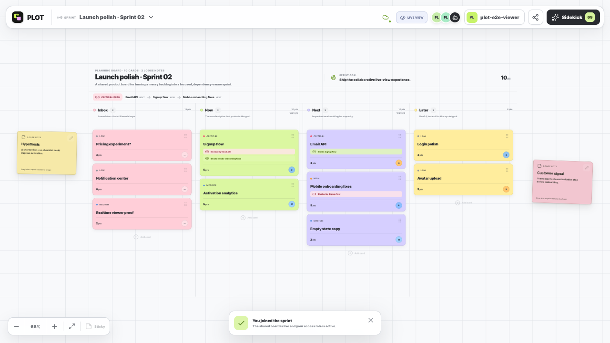
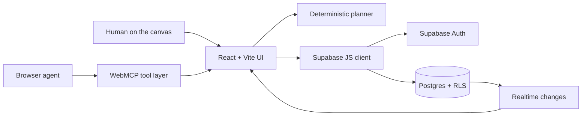

<div align="center">
  
  <h1>PLOT</h1>
  <p><strong>A shared planning canvas for humans and browser agents.</strong></p>
  <p>
    <a href="https://openai.com/webmcp-challenge/">OpenAI WebMCP Challenge</a>
    · <a href="docs/CHALLENGE_SUBMISSION.md">Submission kit</a>
    · <a href="docs/DEPLOYMENT.md">Deployment guide</a>
    · <a href="https://github.com/RZDESIGN/PLOT-Planner-WebMCP">Public repository</a>
  </p>
</div>

PLOT turns a backlog into a visible, dependency-aware plan. Humans and browser agents can place loose sticky notes around the board, shape them into sprint cards, or pull cards back into open thinking while preserving their planning metadata. Agent changes never disappear into chat: every note, card, dependency, and proposal remains visible on the shared canvas.

Built during the submission period for the [OpenAI WebMCP Challenge](https://openai.com/webmcp-challenge/). PLOT is intentionally not a chat wrapper: WebMCP lets the browser agent participate in the same structured, animated and reviewable planning state as the human team.



## Why PLOT

Planning tools usually separate conversation from state. An agent can recommend a plan, but the human still has to translate it into cards, dependencies, and priorities. PLOT closes that gap with three explicit modes:

1. **Observe** — inspect cards, capacity, priorities, and blocking relationships.
2. **Suggest** — render a complete plan as animated ghost cards without changing live state.
3. **Act** — apply only after explicit human review, then persist and broadcast the result.

The sample activation sprint is intentionally imperfect: a critical dependency sits outside `Now`, five points do not protect the sprint goal, and the team has three points of apparent capacity. This gives the agent a useful planning problem to solve rather than a decorative demo.

### Why WebMCP is the right interface

The useful context already exists in the page: card order, estimates, sprint capacity, dependencies, goal fit, proposals, access role and current collaborators. Exposing that state through WebMCP avoids brittle screen scraping and avoids building a second agent-only backend API.

Every tool handler calls the same typed React actions used by the visible interface. Human and agent actions therefore share validation, authorization, animation, Supabase persistence and activity history. The agent can observe, propose and act, while the human can always see what changed and why.

## Challenge proof points

| Requirement | Evidence in PLOT |
| --- | --- |
| Real WebMCP surface | 17 schema-constrained tools registered with `document.modelContext.registerTool()`. |
| Useful agent collaboration | The agent can inspect planning risk, manipulate cards and loose notes, create sprints and propose a dependency-aware plan. |
| Human control | Multi-card changes appear as non-destructive ghost state and require a separate apply action. |
| Shared durable state | Supabase Auth, Postgres, Realtime and private Presence keep people and agents on one board. |
| Safe live viewing | Viewers receive every change in realtime, while UI guards, WebMCP handlers and RLS reject mutations. |
| Verifiable quality | Domain tests, lint, production build, rolled-back database tests and two-session Playwright review are documented below. |

## Product highlights

- Full-screen, four-column planning canvas with accessible keyboard and pointer drag-and-drop.
- Infinite-canvas navigation: pan empty space, zoom around the pointer, or fit the full board in one click.
- Semantic zoom keeps the overview quiet and reveals labels and richer card detail when zoomed in.
- Velocity-responsive card tilt, soft landing, page-curl feedback, and visible agent cursor.
- Freeform sticky notes around the board with animated, bidirectional sticky ↔ card conversion.
- Lossless card round-trips: priority, estimate, labels, owner, goal, and due date survive time outside the sprint.
- Deterministic product-planning analysis: capacity, goal fit, blockers, and focus score.
- Human-in-the-loop proposal flow with separate propose, apply, and dismiss actions.
- Seventeen imperative WebMCP tools, including sprint creation and switching, registered through `document.modelContext.registerTool()`.
- Supabase Auth, Postgres, Realtime, RLS, migrations, and an anonymous public demo template.
- Invite-based owner, editor, and live-view roles with realtime Presence and database-enforced write boundaries.
- Atomic sprint creation with dates, capacity, and the choice to start clean or carry the complete planning state forward.
- Offline fallback so the challenge flow remains explorable if the backend is unavailable.
- Responsive canvas and on-demand Sidekick overlay for desktop and mobile.

## Architecture



The browser agent operates on the live page rather than through a separate server-side MCP process. The tool handlers reuse the same React actions as the visible UI, so agent and human interactions share state, validation, animation, persistence, and activity history. Database-domain validation lives in `src/lib/boardModel.ts`; multi-row layouts, conversions, and proposal application are committed through short transactional Postgres RPCs.

### Stack

- React 19, TypeScript 7 and Vite 8
- WebMCP imperative browser API with `webmcp-types`
- Supabase Auth, Postgres, Realtime Presence and Row Level Security
- dnd-kit plus a custom velocity/spring motion system
- Node test runner, Oxlint and Playwright CLI review

## WebMCP tools

| Tool | Mode | Result |
| --- | --- | --- |
| `plot.get_board` | Observe | Reads columns, cards, loose notes, estimates, owners, labels, and dependencies. |
| `plot.list_sprints` | Observe | Lists every sprint the signed-in collaborator can access. |
| `plot.switch_sprint` | Navigate | Opens an accessible sprint without changing its planning state. |
| `plot.create_sprint` | Act | Creates and opens a clean sprint or an atomic copy of the current plan. |
| `plot.analyze_board` | Observe | Returns focus score, capacity, goal-fit, and blocker insights. |
| `plot.create_card` | Act | Creates a visible card with agent-authored motion. |
| `plot.move_card` | Act | Moves one card and animates it into the destination. |
| `plot.update_card` | Act | Updates card planning metadata. |
| `plot.create_sticky_note` | Act | Places loose thinking at an exact canvas position. |
| `plot.update_sticky_note` | Act | Updates a sticky note's content or color. |
| `plot.move_sticky_note` | Act | Repositions a loose note without committing it. |
| `plot.convert_sticky_to_card` | Shape | Turns a note into structured work in a chosen column. |
| `plot.convert_card_to_sticky` | Unshape | Returns a card to loose thinking while retaining its metadata. |
| `plot.link_dependency` | Act | Creates a directed blocking edge. |
| `plot.propose_sprint` | Suggest | Shows a multi-card plan as non-destructive ghost state. |
| `plot.apply_proposal` | Act after review | Applies the currently reviewed proposal. |
| `plot.dismiss_proposal` | Human control | Removes ghost state without changing the board. |

Read-only tools declare `readOnlyHint`. Every tool has a constrained JSON input schema, an abort-aware handler, readable text output, and structured output. The browser implementation follows the current [WebMCP explainer and imperative API](https://github.com/webmachinelearning/webmcp).

## Local setup

Requirements:

- Node.js 22 or newer
- npm 10 or newer
- A WebMCP-capable browser for tool discovery; the UI itself runs in any modern browser

```bash
npm install
cp .env.example .env.local
npm run dev
```

Open `http://localhost:5173`.

The checked-in `.env.example` contains the PLOT project URL and Supabase publishable key. Publishable keys are intended for public clients; authorization is enforced by RLS. Never add a `service_role` or secret key to Vite environment variables.

### Available commands

```bash
npm run dev      # local Vite server
npm run test     # Node domain regression tests
npm run lint     # Oxlint
npm run build    # TypeScript + optimized production build
npm run check    # tests, lint, and production build
npm run preview  # preview the production output
```

## Supabase

Hosted project: `rarawrgxqbnmzcjhxyic` in `eu-west-1`.

The schema is reproducible from:

- `supabase/migrations/20260829212115_plot_core_schema.sql`
- `supabase/migrations/20260829212203_advisor_fixes.sql`
- `supabase/migrations/20260830075628_sticky_notes.sql`
- `supabase/migrations/20260830081506_atomic_board_mutations.sql`
- `supabase/migrations/20260830081735_atomic_proposal_apply.sql`
- `supabase/migrations/20260830081941_repair_atomic_mutations.sql`
- `supabase/migrations/20260830161714_collaboration_sprints_presence.sql`
- `supabase/migrations/20260830161812_harden_collaboration_helpers.sql`
- `supabase/migrations/20260830161933_grant_rls_helper_execution.sql`
- `supabase/migrations/20260830162112_qualify_invitation_crypto.sql`
- `supabase/migrations/20260830162206_allow_private_helper_resolution.sql`

For a separate Supabase project:

```bash
npx supabase login
npx supabase link --project-ref YOUR_PROJECT_REF
npx supabase db push
```

Then update `VITE_SUPABASE_URL` and `VITE_SUPABASE_PUBLISHABLE_KEY` in `.env.local`. In production, also set `VITE_PUBLIC_APP_URL` to the one canonical HTTPS frontend URL (including a subdirectory path when applicable).

### Data model

- `profiles`
- `boards`
- `board_members`
- `board_invitations`
- `board_columns`
- `cards`
- `sticky_notes`
- `card_dependencies`
- `planning_proposals`
- `proposal_actions`
- `activity_events`

All application tables have RLS enabled. Anonymous visitors can only read the seeded public template. Owners and editors can mutate a shared sprint; viewers can read it and receive the same Realtime updates but cannot write through the UI, WebMCP, REST, or RPC layer. A magic-link sign-in uses PKCE, persists the resulting session in the browser, and turns the explored board into the user's first private sprint. One-use invitation tokens are stored only as SHA-256 hashes, expire after seven days, and may optionally be locked to an email address.

For production, add the deployed URL to **Authentication → URL Configuration → Redirect URLs** in the Supabase dashboard.

## Collaboration, live view, and sprints

Use **Share** in the top bar and choose one of two invitation roles:

- **Can edit** lets a collaborator and their browser agent plan on the board.
- **Live view** gives an authenticated viewer the complete board, Presence, sprint navigation, and instant card/sticky changes without write access.

Each sprint has a stable `?board=<id>` permalink for existing members. A generated invitation adds a separate one-use token, is login-protected, and remains valid for seven days. After acceptance, PLOT removes the token from the address bar while retaining the stable board URL. The people stack in the toolbar shows who is currently present; the Share dialog shows everyone with persistent access.

Create another sprint from the sprint switcher in the top bar. Set its name, goal, capacity, and optional dates, then choose **Clean board** or **Carry everything**. PLOT creates the board, columns, cards, dependencies, and loose notes in one transaction and opens it immediately. The same lifecycle is available to a browser agent through `plot.list_sprints`, `plot.switch_sprint`, and `plot.create_sprint`.

For Hostinger or another static host, upload the contents of `dist/` after `npm run build` and configure an SPA fallback to `index.html`. WebMCP stays in the frontend bundle; Supabase remains the hosted backend. Add the final HTTPS origin to Supabase's Site URL and redirect allow-list before using magic-link invitations in production.

The complete production checklist is in [`docs/DEPLOYMENT.md`](docs/DEPLOYMENT.md).

## Human-in-the-loop demo

1. Open the PLOT Sidekick.
2. Review the three observations: dependency risk, off-goal work, and remaining capacity.
3. Select **Preview result** or ask a browser agent:

   > We have three days left. Protect the sprint goal and show me a realistic plan before applying anything.

4. PLOT places three animated ghost cards:
   - `Email API`: Next → Now
   - `Activation analytics`: Now → Later
   - `Mobile onboarding fixes`: Next → Now
5. Choose **Dismiss** to prove the proposal is non-destructive, or **Accept all** to apply it.
6. The critical path becomes fully aligned, `Now` becomes exactly 13/13 points, and the focus score rises from 69 to 92.

## Testing and review

Pure board rules have Node regression coverage in `tests/boardModel.test.ts`. End-to-end review uses the Playwright CLI against the real page and WebMCP page bridge. Review artifacts include full-screen desktop, mobile overview, mobile Sidekick, proposal, applied-plan, zoom/pan, and in-motion drag screenshots under `output/playwright/`. The original sprint walkthrough is available at `output/playwright/plot-motion-demo.mp4`; the focused sticky/card round-trip is recorded at `output/playwright/plot-sticky-conversion-demo.mp4`. Local browser traces remain in the ignored `.playwright-cli/traces/` directory.

Verified flows:

- Supabase public-template loading and live connection state
- proposal preview, dismiss, and sequential apply
- focus-score and capacity recalculation
- card creation form and board insertion
- sticky-note creation and color editing
- freeform note movement and sticky → card conversion by dropping into a column
- card → sticky conversion outside the board and lossless metadata/dependency restoration on return
- all 17 WebMCP schemas, including sprint lifecycle tools, plus the five sticky-note mutation flows through the page bridge
- invalid columns, out-of-range values, cyclic dependencies, duplicate proposals, and live mutations during proposal review are rejected
- transactional Supabase layout, sticky ↔ card, proposal-create, and proposal-apply paths in a rolled-back authenticated test
- desktop, 1200px, and 390px responsive layouts
- two isolated authenticated sessions with owner/viewer Presence, one-use invite acceptance, and a new card appearing live without refresh
- viewer REST reads succeeding while an attempted card insert is rejected with HTTP 403 by RLS
- Sidekick open/close behavior
- Spring-based canvas fit, stacked button zoom, pointer-centered zoom, and inertial background panning
- Velocity-driven card tilt, lift, stretch, drop overshoot, and animated column reflow
- Sequential ghost-card and approved agent-card motion
- Semantic detail changes between overview and close-up zoom levels
- Immediate motion fallbacks under `prefers-reduced-motion: reduce`
- zero final browser console errors or warnings in the anonymous demo flow
- TypeScript, lint, and production build

## Security notes

- Only the Supabase publishable key is used by the browser.
- RLS is the authorization boundary for all public-schema tables.
- Security-definer functions use a fixed `search_path` and restricted execution grants.
- Public mutation RPCs run as `security invoker`, retain RLS enforcement, and expose execution only to `authenticated`.
- Private proposals, actions, boards, cards, sticky notes, and activity events remain board-member scoped, with write access limited to owners and editors.
- Live-view restrictions are repeated in the UI, WebMCP handlers, table policies, and transactional RPC authorization checks.
- Realtime Presence uses a private board topic authorized through `realtime.messages` policies.
- Agent proposal actions do not alter live state until the explicit apply step.
- Database foreign keys used by RLS and Realtime paths are indexed.

## Challenge submission

The submission narrative, sub-three-minute demo script, judging-criteria mapping and honest launch checklist live in [`docs/CHALLENGE_SUBMISSION.md`](docs/CHALLENGE_SUBMISSION.md).

## Contributing and security

Contributions are welcome; see [`CONTRIBUTING.md`](CONTRIBUTING.md). Please report security issues privately as described in [`SECURITY.md`](SECURITY.md), particularly anything involving RLS, invitation tokens or authorization boundaries.

## License

MIT — see [`LICENSE`](LICENSE).
